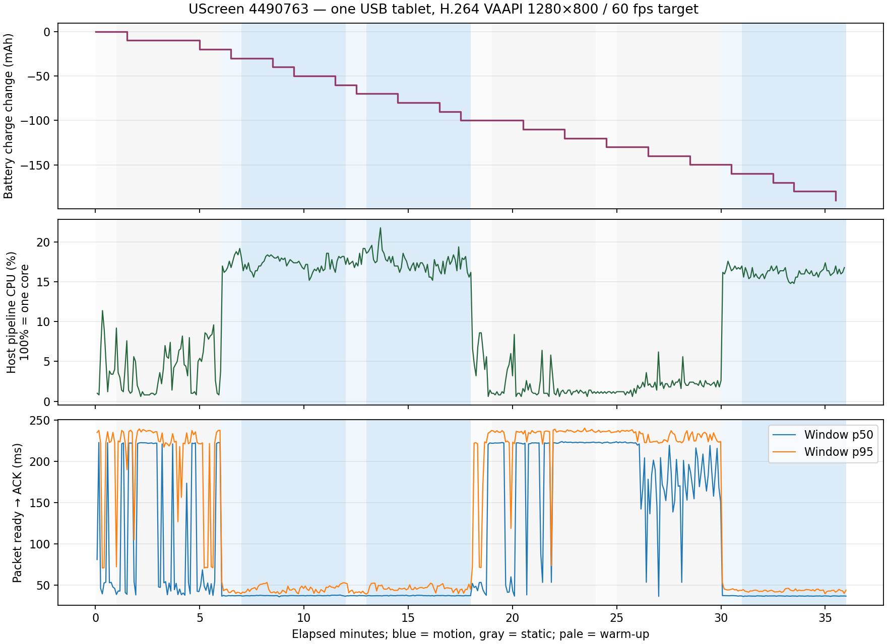

# One-tablet baseline before the next optimization series

This baseline measures the current fork at `4490763`, including the incremental
Annex-B scanner in `1e7b045`. It does not compare against the old scanner or claim
optimization gains. Linux and Android were rebuilt and installed before the run;
the next optimization series should repeat this workload with matching settings.

The [methodology](README.md) defines the workload, collector and units. The
[raw artifact directory](2026-09-17-device-baseline/) preserves deployment hashes,
phase boundaries, process/battery observations, original-timestamp timing logs,
the calculated summary and a timeline plot.

## Deployed configuration

| Setting | Value |
| --- | --- |
| Runtime source | `4490763f4bcaf79fabdff1aa78809281266131b8` |
| Host | Ryzen 9 7945HX, Linux Mint 22.3, kernel 7.0.0-31-generic; Cinnamon/X11 |
| Linux build | Release, Rust 1.90.0, GCC 12.2.0; default external-FFmpeg encoder |
| Capture/encode | EVDI/libevdi 1.15.0, AMD Navi 23 (`1002:73ff`) / `amdgpu`, `h264_vaapi`, `/dev/dri/renderD128` |
| FFmpeg | Stock Ubuntu `6.1.1-3ubuntu5`; no patches |
| Stream | 1280×800, 60 fps target, quality 18, scale 1, automatic resolution |
| Configured bitrate | 20,000 kb/s; VAAPI CQP does not enforce this ceiling (T259) |
| Tablet | Ulefone RugKing Pad 2 Pro, Android 16; debug APK 1.2.3/code 12 |
| Decoder | `c2.unisoc.avc.decoder`, reported as `hw-video-codec` by Android |
| Display | App brightness 0.5; observed hardware active mode 60 Hz |
| Transport | USB/ADB, 480 Mb/s through Generic Realtek `0bda:5432` hub |
| Power report | USB powered; maximum charging current 500,000 µA, voltage 5,000,000 µV |
| Workload | Three static/motion pairs, reversed order in pair 2; 60 s warm-up and 300 s measurement per phase |

The installer updated the user installation and restarted only the UScreen
service. Cinnamon and Xorg retained their original process identities. Android
installation used `adb install -r`; its 159 unit tests and lint passed. The Linux
runtime source already passed the workspace/native/tooling and optional-encoder
tests plus both Clippy configurations before deployment. This successful Android
launch does not close the intermittent cold-start issue T395.

## Measured results

Collection ran on 2026-09-17 from **14:39 to 15:15 UTC** (16:39–17:15 CEST).
All three motion trials sustained a median 60 encoded access units/s. The host
pipeline used a median 16.0–17.4% of one CPU core during motion; the Android app
used 69.0–73.0% of one core. The tablet lost charge throughout the run despite
reporting USB power.

CPU values below are medians of five-second process-counter intervals;
**100% means one core**, not the whole machine. Encoded FPS and bitrate are
medians of the encoder's logged windows. The host pipeline sums daemon, helper
and FFmpeg; the independently calculated component medians need not sum to the
median of their total.

| Trial | Workload | Encoded FPS | Encoded Mb/s | Host pipeline CPU % | Android app CPU % |
| --- | --- | ---: | ---: | ---: | ---: |
| 1 | Static | 12.95 | 1.71 | 3.6 | 21.4 |
| 1 | Motion | 60.00 | 29.07 | 17.4 | 73.0 |
| 2 | Motion | 60.00 | 29.22 | 17.4 | 71.8 |
| 2 | Static | 5.00 | 1.70 | 1.2 | 11.4 |
| 3 | Static | 7.25 | 1.68 | 2.0 | 13.8 |
| 3 | Motion | 60.00 | 28.85 | 16.0 | 69.0 |

The next table contains **medians of logged window p50/p95 values**, not pooled
frame percentiles. Each measured phase contributed 57–58 latency windows after
excluding boundary windows. Battery rates use ten samples spanning about 270 s
within each five-minute phase; negative current means net discharge.

| Trial | Workload | Packet ready → ACK window p50, ms | Packet ready → ACK window p95, ms | Net battery mA |
| --- | --- | ---: | ---: | ---: |
| 1 | Static | 53.95 | 223.75 | −266.4 |
| 1 | Motion | 37.00 | 45.10 | −399.6 |
| 2 | Motion | 37.10 | 45.75 | −399.6 |
| 2 | Static | 222.30 | 236.10 | −266.4 |
| 3 | Static | 185.80 | 229.00 | −266.4 |
| 3 | Motion | 36.60 | 43.20 | −399.6 |

Across all 72 battery observations, including warm-ups, charge fell from
8,551,440 to 8,361,630 µAh: **−189.81 mAh over 2,130.04 s**, equivalent to
**−320.8 mA net battery current**. Displayed charge fell from 86% to 84%.
Battery temperature stayed between 30.9 and 31.4 °C; the reported thermal status
remained 0. All battery samples reported USB power and the same 5 V/500 mA limits.

The charge counter changed in **9.99 mAh steps**. A single step over a 270 s
phase changes the calculated rate by 133.2 mA, so the identical rounded rates
across trials reflect coarse gauge quantization as well as the workload.
These short phases cannot establish small battery savings. The longer whole-run
trend is useful evidence of sustained discharge, not isolated app consumption.

During motion, helper CPU medians were 11.6–12.6%, FFmpeg 3.8–4.0%, daemon
0.6–0.8%, and the benchmark workload/observer 2.0–2.2% of one core. Cinnamon
and Xorg were measured separately. Median process RSS across phases was
10.2–11.4 MiB for the daemon, 9.4 MiB for the helper, 120.1 MiB for FFmpeg and
207.0–222.0 MiB for the Android app. Android's 36 minute-spaced memory snapshots
reported 93.2–115.8 MiB PSS. RSS includes shared pages; these values neither
establish unique memory usage nor demonstrate a leak.

## Findings and data integrity

- **T388:** sustained discharge is reproduced with hardware decoding, app-only
  50% brightness/60 Hz and the current USB source. Separate charging-source
  capability from app efficiency; add an app-off control and longer matched
  power trials before attributing consumption or claiming savings.
- **T399/T386/T382:** static target content still produced variable capture and
  encoded rates on this shared Cinnamon desktop. Sparse periods often showed
  about 220 ms packet-to-ACK windows, versus about 37 ms in motion. This needs
  correlated stage tracing and an isolated idle comparison; the present data
  does not identify the responsible stage. Motion provides the more consistent
  initial comparison workload.
- **T259:** roughly 29 Mb/s motion output exceeds the configured 20 Mb/s value,
  supplying physical-driver evidence for the already documented CQP ceiling
  limitation. A bounded-versus-explicitly-uncapped policy is still undecided.
- **T382:** one tablet, partial-path log windows and net battery counters do not
  complete the end-to-end, input-latency or multi-device measurement matrix.

The archive has 432 process samples, 72 battery/display/thermal observations,
12 phase starts plus a completion event, and 2,492 recovered performance log
records. Sample gaps ranged from 5.00003 to 5.00046 s. Collection took a median
0.158 s and a maximum 0.573 s; host one-minute load ranged from 0.073 to 1.395.
Daemon, helper, FFmpeg, Android app, Cinnamon and Xorg retained their process
identities. The filtered Android log contains no decoder-reset/output-thread
failure messages. No screenshot, input trace or authentication token is stored.

The initial collector omitted journald byte-array `MESSAGE` values (T410).
The complete performance interval was recovered from the retained journal using
its original timestamps and an expanded filter that includes the tablet timing
split. The archive keeps the incomplete original separately; only the recovered
`host-windows.jsonl.gz` is used for analysis. Product code and the running
workload were unchanged. Initial loaded script hashes and the corrected
recovery/analysis hashes are both retained in the metadata.

T410's permanent regression failed before the fix and passed afterward.
T411's three invalid-monitor cases also failed before the exact-geometry fix;
the actual baseline monitor was separately verified as 1280×800 at +3840+0.
All eight benchmark tests pass through the normal Rust tooling suite. T412
corrected misleading render-timing comments without changing runtime behavior.
The complexity gate reports no function above 9. Each resolved finding has its
own commit; the matching TODO entries were removed.

## USB-C charging interpretation

USB 2.0 data and higher charging power can coexist: this tablet's manufacturer
lists both USB 2.0 Type-C and up to 18 W using its original charger/cable.
That does not establish which charging protocol works with the current hub or
guarantee 18 W during computer data transfer. See the
[manufacturer's specifications](https://www.ulefone.com/products/rugking-pad-2-pro).

USB-C uses configuration-channel signalling for power roles/current and Power
Delivery communication for higher voltages; the USB data speed is a separate
property. See [TI's controller explanation](https://www.ti.com/document-viewer/lit/html/SSZTBP5/GUID-4447F8A4-610E-43FC-8D6F-1DF9FA438525).
The host exposes no `/sys/class/typec` control here. There is no demonstrated
UScreen/ADB command that raises the source's advertised power.

The observed 5 V/500 mA report corresponds to 2.5 W, but is not an actual USB
power measurement. A separate experiment should compare a direct computer port
with documented charging output, or a powered hub whose **downstream data port**
supports the tablet's charging mode. A hub's PD input rating alone does not
establish that downstream capability. Keep the original route for software A/B
comparisons. T388 tracks this power-source experiment alongside app efficiency.

## Measurement limits

This is one physical tablet, one encoder/driver and a debug APK on a shared
desktop. No other charging source, codec, resolution, frame-rate policy, app-off
control or multi-tablet case was measured. App CPU excludes separate codec and
compositor processes; host pipeline CPU excludes Cinnamon/Xorg and the workload.
The collector itself performs ADB/process polling, so the result includes its
observer effect. Raw process identities, host load and collection times are kept.

The reported latency starts when an encoded access unit is ready and ends when
its render acknowledgement reaches the host. It excludes capture/encoding and
packetizer assembly, and callback dispatch is not physical screen presentation.
The report summarizes logged window statistics; it cannot reconstruct pooled
frame p95/p99 or input-to-photon latency. Sparse-stream delay needs correlated
tracing before assigning it to decoder buffering, callback scheduling or another
stage. Helper capture-to-FIFO statistics begin after the framebuffer grab and
must not be added to independent latency percentiles.

Battery results describe net charge loss while USB powered, including the rest
of Android. They do not isolate app energy or measure USB input watts. Charging
state text can say “charging” while the charge counter falls. Gauge quantization
and short phase intervals limit comparisons between workloads; preserve the
longer whole-run trend as well as the individual trial endpoints.

The broader T382 campaign is closed as `wont_fix` for now; maintainer
multi-tablet testing and large/NUMA-host measurements are outside the current
scope. This preserves the measurement limits identified above. T386/T388/T399
record the separate decoder, power and frame-admission work. Implementations need their permanent regressions
and a repeat of this baseline before any gain is claimed.
