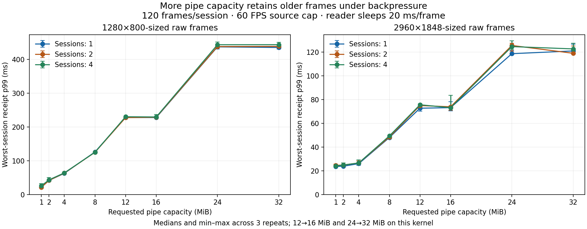

# Raw-pipe capacity ramp — 2026-09-17

T405/T389 experiment: compare requests of **1, 2, 4, 8, 12, 16, 24 and
32 MiB**. A MiB is 1,048,576 bytes. The production helper's best-effort
1 MiB request remains unchanged. Larger pipes reduced transfer CPU in some
cases, but 16/32 MiB did not establish an advantage over a pipe just large
enough for one frame and substantially increased slow-reader frame age.
These tests use isolated anonymous pipes;
they do not open EVDI, attach a display, contact ADB or change system settings.

## Main matrix results

These tables report the instrumented matrix (queue-depth sampling enabled).
CPU is milliseconds per 120-frame trial; latency columns are milliseconds.
The complete 1/2/4-session results, repeat ranges and operation counts are
preserved in the machine-readable summary.

### 1280×800-sized frames, one session

| Requested MiB | Paced CPU ms | Paced write p99 ms | Paced receipt p99 ms | Slow receipt p99 ms |
| ---: | ---: | ---: | ---: | ---: |
| 1 | 79.0 | 0.50 | 0.69 | 21.5 |
| 2 | 66.0 | 0.49 | 0.88 | 41.6 |
| 4 | 66.2 | 0.41 | 0.87 | 62.6 |
| 8 | 68.9 | 0.41 | 0.84 | 125.9 |
| 12 | 65.6 | 0.48 | 0.87 | 228.2 |
| 16 | 66.3 | 0.41 | 0.81 | 227.9 |
| 24 | 66.9 | 0.39 | 0.75 | 437.4 |
| 32 | 62.4 | 0.36 | 0.71 | 435.5 |

### 2960×1848-sized frames, one session

| Requested MiB | Paced CPU ms | Paced write p99 ms | Paced receipt p99 ms | Slow receipt p99 ms |
| ---: | ---: | ---: | ---: | ---: |
| 1 | 496.9 | 3.08 | 3.26 | 23.6 |
| 2 | 537.3 | 3.32 | 3.81 | 23.8 |
| 4 | 468.7 | 3.13 | 3.99 | 26.0 |
| 8 | 338.1 | 2.25 | 4.43 | 48.0 |
| 12 | 343.3 | 2.58 | 4.51 | 72.8 |
| 16 | 347.4 | 2.47 | 4.96 | 73.2 |
| 24 | 358.9 | 2.58 | 4.58 | 118.8 |
| 32 | 352.1 | 2.42 | 4.57 | 121.1 |

At four sessions, the larger-frame paced CPU medians were 3,126 ms at
1 MiB, 2,127 ms at 8 MiB, 2,021 ms at 16 MiB and 2,163 ms at 32 MiB.
These are summed process CPU times across eight worker threads during a
roughly two-second trial. They are not milliseconds of delay per frame.
The corresponding worst-session receipt p99 medians were 4.74, 5.93, 6.67
and 6.81 ms. Larger buffers do not automatically improve receipt latency.

Under the deliberately slow reader, baseline-sized frames accumulated about
228 ms of receipt age at 16 MiB and 436 ms at 32 MiB in the single-session
case, compared with about 22 ms at 1 MiB. Larger frames fit fewer times into
the same capacity, but the same mechanism appears: about 24, 73 and 121 ms
at 1, 16 and 32 MiB. These finite 120-frame trials demonstrate extra queued
video; they do not establish a steady-state bound for every workload.

The equally sized 12/16 and 24/32 request pairs help reveal measurement
variability. Their differing timings do not imply different effective pipe
sizes. Compare repeated results and their ranges before choosing a capacity.

## Sampling-overhead control

The control adds 192 trials: both frame sizes, 1/4 sessions, all eight
capacities, sampling on/off and three shuffled repeats. CPU results below
exclude queue-depth sampling and are medians for 120 frames per session.
The raw/CSV summaries retain both variants and min/max repeat values.

| Requested MiB | Baseline CPU ms, 1 session | Baseline CPU ms, 4 sessions | Larger CPU ms, 1 session | Larger CPU ms, 4 sessions |
| ---: | ---: | ---: | ---: | ---: |
| 1 | 77.4 | 319.6 | 505.5 | 2973.3 |
| 2 | 65.2 | 296.5 | 476.9 | 2984.1 |
| 4 | 62.3 | 287.6 | 443.0 | 2798.3 |
| 8 | 61.9 | 308.2 | 350.1 | 1947.4 |
| 12 | 65.1 | 276.5 | 355.9 | 2134.7 |
| 16 | 66.8 | 279.9 | 344.2 | 2416.4 |
| 24 | 65.6 | 307.9 | 355.6 | 2500.8 |
| 32 | 65.7 | 279.8 | 335.3 | 2178.1 |

The larger-frame 1→8 MiB CPU reduction persists without the extra ioctls:
about **30.7% at one session** and **34.5% at four sessions**. This is a
transfer/verification microbenchmark gain, not a full UScreen gain. The
baseline-size 1→2 MiB reductions were about 15.8% and 7.2%; repeat ranges
overlapped, especially at four sessions. Additional capacity did not give a
consistent further improvement across cases.

At the larger size, four-session 16 MiB CPU ranged from 1,786 to 3,396 ms,
while 8 MiB ranged from 1,915 to 2,080 ms. The 32 MiB median was 2,178 ms.
At one session, 8/16/32 MiB CPU medians were 350/344/335 ms with overlapping
repeat ranges. These results cannot establish 16 or 32 MiB as a better default.

Paced writes averaged about 9.2 attempts per baseline-sized frame at 1 MiB
versus one at 2 MiB; larger frames averaged about 111.5 at 1 MiB versus one at
8 MiB in the single-session control. Counts include failed attempts and depend
on reader progress. A requested read/write length is not a syscall-count
guarantee. For larger frames, receipt p99 still increased: 2.88→4.67 ms at one
session and 4.41→5.69 ms at four sessions for 1→8 MiB, despite faster writes.

**Recommendation:** retain the current default while evaluating a bounded,
frame-size-aware request with the real stock-FFmpeg pipeline. The useful
candidates here are 2 MiB for baseline frames and 8 MiB for larger frames;
16/32 MiB do not have sufficient evidence for adoption. A future setting must
report effective capacity, tolerate denied enlargement and account for session
count and old-frame latency. Do not grant the production service a new
capability or require a host sysctl change merely to reproduce this experiment.



## Actual capacity and portability

| Requested MiB | Effective MiB on this kernel | Maximum whole baseline frames in that many bytes | Maximum whole larger frames |
| ---: | ---: | ---: | ---: |
| 1 | 1 | 0 | 0 |
| 2 | 2 | 1 | 0 |
| 4 | 4 | 2 | 0 |
| 8 | 8 | 5 | 1 |
| 12 | 16 | 10 | 2 |
| 16 | 16 | 10 | 2 |
| 24 | 32 | 21 | 4 |
| 32 | 32 | 21 | 4 |

The frame columns are floor(capacity/frame size), not a guarantee of usable
pipe space or an assertion that these frames are always queued. Baseline frames
are 1,536,000 bytes (1280×800 NV12); larger frames are 8,205,120 bytes
(2960×1848 NV12). A pipe smaller than one frame works through partial writes.

Linux may round capacity to the next power-of-two page multiple. This explains
why 12/16 and 24/32 requests produce identical capacities. The actual result
is recorded for every channel; a failed resize aborts the benchmark rather
than mislabeling a smaller fallback. See
[F_SETPIPE_SZ](https://man7.org/linux/man-pages/man2/F_GETPIPE_SZ.2const.html).

Host: AMD Ryzen 9 7945HX, 32 allowed logical CPUs, Linux 7.0.0-31-generic;
Debian 12 container, GCC 12.2.0, glibc 2.36. CPU placement/frequency and other
desktop activity were not pinned or controlled.

The host's `pipe-max-size` is 1,048,576 bytes; unprivileged enlargement above
it is unavailable here. Tests run in a disposable container with
`CAP_SYS_RESOURCE`, using only its own pipes. No sysctl is changed and no
capability is added to UScreen. The observed per-user soft limit is 16,384
pages and the hard limit is zero. A production policy must handle both the
individual ceiling and aggregate per-user limits, retaining a working smaller
pipe when enlargement is denied. Four filled 32 MiB pipes can hold up to
128 MiB of raw payload, separate from T391's encoded-storage budgets; process
RSS does not account for kernel pipe buffers. See
[pipe capacity and limits](https://man7.org/linux/man-pages/man7/pipe.7.html).

## Workloads and interpretation

The main matrix has two frame sizes, 1/2/4 independent sessions, eight requested
capacities, three workload modes and three repeats: 432 trials. Every trial
sends and verifies 120 frames per session. Capacity order is shuffled with a
recorded seed within each workload/repeat; runs are serial on the existing
desktop, without concurrent agent compilation or other benchmarks.

Each session owns a nonblocking writer, a blocking reader and separate threads.
The writer attempts a write, handles partial progress and waits with `poll`
after EAGAIN. This is a small readiness loop, not the production helper's exact
poll-before-write implementation. Readers request at most 64 KiB for the body
and verify every byte. A 16-byte sequence/monotonic-time header replaces the
first 16 bytes of each synthetic frame. This is not the production raw format.

| Mode | Producer | Reader |
| --- | --- | --- |
| peak | As fast as admitted | Immediate drain and verification |
| paced | At most 60 frame starts per second, no catch-up bursts | Immediate drain and verification |
| slow | Same paced producer | Sleeps 20 ms after each complete verified frame |

The slow reader therefore processes **at most** 50 FPS, with read/verification
time added to its delay. It models a consumer falling behind; it does not model
an actual encoder, Bluetooth path or Android decoder. A new source timestamp
is taken at each frame's write attempt. There is no queue of captured frames
before that point, while bytes already admitted to the pipe preserve order.

Reported CPU includes both threads, payload verification, readiness waits and
instrumentation. Payload initialization/thread creation precede measurement;
the first write's pipe-page allocation and final drain are included. CPU is
total process CPU, not a percentage or isolated writer CPU. Wall time includes
pacing and the final slow-reader sleep. Peak throughput is aggregate verified
payload across all sessions, not an encode or USB bandwidth measurement.

Write duration ends when the complete frame has been accepted by the kernel.
Receipt age ends when the reader verifies the complete frame, using the same
host monotonic clock as its timestamp. It includes writer blocking and time
queued in the pipe; it excludes that frame's subsequent simulated processing
delay. Neither metric measures capture-to-display latency or A/V synchronization.
For multiple sessions, each trial reports the **worst session's p99**; tables
then take the median across repeats. These are not pooled frame percentiles.

Queue depth is sampled using `FIONREAD` after successful writes. The maximum is
a sampled lower bound on peak unread bytes, not a complete occupancy trace.
Sampling adds a syscall per successful write and may bias CPU comparisons
toward larger pipes. A separate paired control repeats the capacity ramp with
sampling enabled/disabled for paced 1/4-session workloads at both frame sizes.
It records absent occupancy measurements as null in its summary.

## Relationship to the other work

Increasing capacity does not remove the FIFO payload copy, accelerate the
encoder, negotiate USB power or synchronize audio clocks. It can reduce
partial writes while admitting more old frames before the writer experiences
backpressure. T389 evaluates the stock-FFmpeg pipeline and raw ownership
alternatives; T405 retains readiness, cancellation and measured sizing work.
T226's partial-frame/inode recovery remains required for any production change.

T414 records the user's older-build YouTube report and Bluetooth-headset/tablet
setup. These synthetic results demonstrate a possible queueing mechanism,
not the cause of that report. Confirm player location, audio route, fixed
offset versus drift, and physical presentation timing before selecting a fix.
The separate [io_uring replay](2026-09-17-io-uring.md) evaluates submission APIs;
ordinary io_uring I/O does not by itself address stale raw frames.

## Reproduce and audit

Use the project's isolated CI image, built as described in
[development](../development.md), or a comparable Linux image with GCC and
Python 3. The image used here is recorded with the artifacts. For example:

```sh
mkdir -p /tmp/uscreen-pipe-ramp
docker run --rm --cap-add SYS_RESOURCE \
  -v "$PWD:/work:ro" -v /tmp/uscreen-pipe-ramp:/results \
  uscreen-ci:perf python3 scripts/benchmarks/pipe-capacity.py \
  --trials 3 --frames 120 --output /results/results.json
docker run --rm --cap-add SYS_RESOURCE \
  -v "$PWD:/work:ro" -v /tmp/uscreen-pipe-ramp:/results \
  uscreen-ci:perf python3 scripts/benchmarks/pipe-capacity-control.py \
  --trials 3 --output /results/control.json
python3 scripts/benchmarks/summarize-pipe-capacity.py \
  /tmp/uscreen-pipe-ramp/results.json --csv > /tmp/uscreen-pipe-ramp/summary.csv
```

The [artifact directory](2026-09-17-pipe-capacity/) preserves raw trials,
machine-readable summaries, the exact original matrix source/controller,
validation evidence and SHA-256 hashes. The current harness adds an optional
sampling switch; its default preserves the original instrumented workload.
All sequence and byte-integrity assertions remain enabled in optimized builds.
ASan/UBSan smoke coverage checks the harness; no production code changes in
this experiment.
