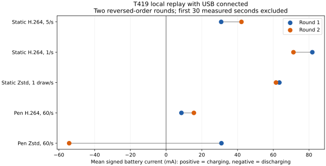
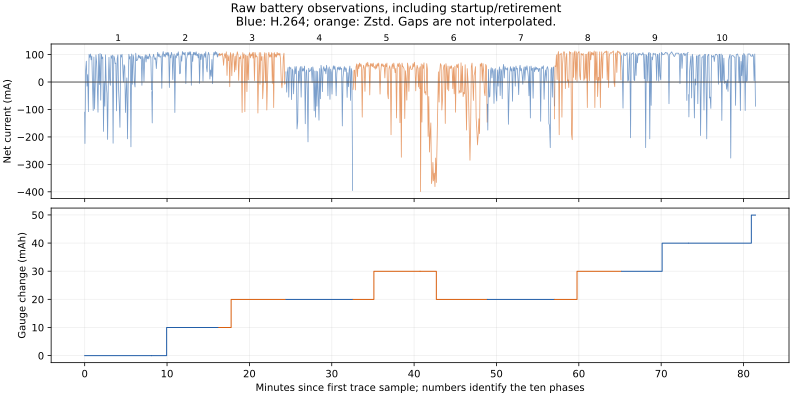

# T419 — presentation omissions and sustained battery flow

**Keep hardware H.264 for the battery-focused setup.** RGB reduced pen replay
app CPU by about 33%, but did not demonstrate a repeatable battery advantage.
At one static update/s, H.264 had more positive net charging current than RGB
in both rounds. Reducing unnecessary idle video work is the stronger next
candidate; it still requires live-pipeline validation under T492.

The follow-up traces explain the missing presentation records in two complete
H.264 replays: **39 buffers were queued but never latched by SurfaceFlinger**.
Those decoder callbacks were not proof that the corresponding pictures reached
the display. This is evidence about compositor admission, not an application
crash or a reason to force an unbounded presentation queue.

This continues the [Android rectangle comparison](2026-09-19-rectangle-renderer.md).
Production UScreen behavior and defaults remain unchanged.

## Presentation diagnosis

Two isolated H.264 motion runs used the previous measured APK and fixtures,
20 measured seconds after four seconds of warmup, 1280×800 at nominal 60 FPS,
50% brightness and 60 Hz. The existing SurfaceFlinger history sampler ran
alongside Perfetto's `android.surfaceflinger.frame` and frame-timeline data
sources. The latter did not supply usable per-buffer SurfaceView outcomes;
the diagnosis uses the frame source's Queue, Latch and PresentFenceSignaled
events instead.

| Complete trace | Eligible interior frames | Matched history presentations | Queued, never latched | Validated sequence/frame pairs |
| --- | ---: | ---: | ---: | ---: |
| 02 | 1,023 | 1,018 | 5 | 1,403 |
| 03 | 1,023 | 989 | 34 | 1,394 |

Both runs produced all 1,200 measured decoder callbacks. Perfetto captured
all 1,440 unique queued frames including warmup for the exact replay SurfaceView
layer. The interior comparison excludes the first measured second and final
two seconds, matching the prior report. Every absent history entry in this
window had a Queue event but no Latch or presentation event. Later frames on
that layer did latch and present. No trace error or data-loss statistic was
reported.

The analyzer converts Perfetto BOOTTIME to the app's MONOTONIC clock using
recorded clock snapshots. It derives the constant frame-number/sequence offset
from matching presentation timestamps, with a 2 µs tolerance, and rejects
inconsistent identity or an incompletely covered window. Both traces validated
offset zero; that equality is an observed property of these sessions, not a
general protocol assumption. The exact layer restriction excludes splash and
Activity UI buffers.

A first exploratory trace started after replay was already running. It cannot
classify that trial's earlier omissions and is retained as excluded evidence.
Likewise, the original report's 43 omissions have no corresponding Perfetto
trace; the new evidence explains a reproduced mechanism without retroactively
classifying each old event.

Android documents that Surface output may discard excess buffers, with View
surfaces having their own dropping behavior. The compositor trace corroborates
queued-but-unlatched frames on this tablet; it does not establish the precise
vendor scheduling decision for each omission. Keep callback acknowledgements,
compositor presentation and optical display timing distinct.
[MediaCodec Surface output](https://developer.android.com/reference/android/media/MediaCodec)

## Battery comparison design

The maintainer made the plugged-in tablet available for 60–90 minutes. The
separate replay APK cancels on touch, focus loss, pause or Surface loss. Linux
keyboard focus does not affect this local replay. The workload uses precomputed
files, so this measures tablet rendering with USB attached, excluding live
host compression and streaming transport costs.
It does not complete T388's separate normal-versus-saver live USB comparison
or its streaming-off control.

Five cases run for eight measured minutes each after four warmup seconds,
then repeat in reverse order: static H.264 at five updates/s, static H.264 at
one update/s, static Zstd rectangles at five inputs/s with one actual refresh/s,
pen H.264 at 60 inputs/s, and pen Zstd rectangles at 60 inputs/s. Both pen paths
request the same cadence, but decoder callbacks alone do not certify identical
physical presentation counts. H.264 remains lossy 4:2:0; rectangles retain RGB.

The updated research APK supports a bounded maximum of 600 seconds. Rectangle
trace storage now scales with rate/duration and is allocated before the timed
phase; do not pool its process-memory measurements with the previous APK's
fixed short-trial storage. Production decoder code and native compression
libraries are unchanged. Brightness, refresh, encoded fixtures and decoder
selection match the previous experiment.

Perfetto polls charge, capacity, signed current and voltage on the tablet every
five seconds; the host samples process resources every 30 seconds. The analyzer
excludes the first 30 measured seconds in each phase, checks trace loss and
clock conversion, rejects missing counters or gaps exceeding six seconds,
and integrates current with actual sample intervals. Endpoint battery and
thermal observations remain in the raw evidence. The reverse order balances
linear time drift; two repetitions do not eliminate temperature, charging or
background-activity variability.

The candidate criterion requires more positive RGB net current than its matched
H.264 case in **both** order-balanced rounds, followed by a check of gauge
deltas, temperatures, coverage and variation. The interpretation file was
written after the first phase finished but before any phase's battery trace
was analyzed; it was not preregistered before collection. Zstd was selected
because earlier UI trials showed similar tablet CPU to LZ4 with fewer bytes,
not because either had already demonstrated an energy advantage.

**These are net battery-flow measurements while USB is connected.** Positive
current means the battery is charging, negative means discharging. They do
not measure USB input power or absolute device consumption. The gauge is
coarse, and reported charging status alone does not prove positive battery
flow. No charging controls or simulated battery values are changed.
[Perfetto battery-counter boundaries](https://perfetto.dev/docs/data-sources/battery-counters)

## Results

All ten phases completed in about **82 minutes**, including transitions and
cleanup. Each accepted stable window has 90 samples spanning approximately
445 seconds, after the settling exclusion. All phases used the same long-run
APK and unchanged collectors; no error/data-loss statistic or sampling gap
invalidated a phase. Observed battery temperature was 31.0–31.2°C.

| Case | Round 1 net current (mA) | Round 2 net current (mA) | Mean (mA) | Gauge change, rounds 1 / 2 (mAh) |
| --- | ---: | ---: | ---: | ---: |
| Static H.264, 5 updates/s | +30.85 | +42.20 | +36.53 | 0 / +9.99 |
| Static H.264, 1 update/s | +81.88 | +71.30 | +76.59 | +9.99 / +9.99 |
| Static Zstd, 1 draw/s | +63.43 | +61.53 | +62.48 | +9.99 / +9.99 |
| Pen H.264, 60 inputs/s | +8.60 | +15.57 | +12.09 | 0 / 0 |
| Pen Zstd, 60 inputs/s | +31.00 | −54.23 | −11.62 | +9.99 / −9.99 |

Positive means net charging while USB is connected. Gauge changes cover each
stable window and occur in coarse 9.99 mAh steps; they cannot resolve the small
differences between every case. Integrated current estimates are retained
separately in the [machine-readable summary](2026-09-19-presentation-power/battery-summary.json),
alongside every counter sample. Neither integral nor gauge is a measurement
of USB input energy or a battery-life prediction.

Changing static H.264 from five updates/s to one improves net current by
**51.0 mA and 29.1 mA** in the two rounds, averaging **40.1 mA**. One-update/s
H.264 also exceeds static RGB by 18.5 mA and 9.8 mA. RGB beats the five-update/s
control, but that advantage does not survive comparison with reduced-cadence
H.264. This supports investigating idle cadence first; it does not prove that
the live capture/encoder path will reproduce the local-replay gain.

The pen result fails the candidate criterion. RGB's net-current difference
against H.264 is **+22.4 mA in round one but −69.8 mA in round two**. The two
consecutive RGB phases themselves differ by 85.2 mA despite similar app CPU
and battery temperature. There is no justified repeatable battery-saving
claim, and these observations do not identify the cause of the variation.

The CPU result is much more consistent: pen RGB uses 27.93% and 28.09% of one
core, versus H.264's 42.05% and 41.92%, approximately **33% less app CPU** on
average. Sampled app PSS is 60.73–61.43 MiB for RGB and 41.02–53.17 MiB for
H.264. These are instrumented long-replay observations. Both paths report
28,800 updates/callbacks per phase, which is not proof that all 28,800 pictures
were physically presented. Lower CPU, RGB fidelity and fewer Java allocations
remain useful properties, but do not override the measured battery result.

| Case | Mean app CPU (% of one core) | Sampled app PSS range (MiB) | Mean codec-service CPU (%) | Mean SurfaceFlinger CPU (%) | Mean composer-service CPU (%) |
| --- | ---: | ---: | ---: | ---: | ---: |
| Static H.264, 5/s | 8.54 | 34.77–39.03 | 1.42 | 4.36 | 1.13 |
| Static H.264, 1/s | 6.05 | 36.96–38.19 | 0.35 | 1.03 | 0.26 |
| Static Zstd | 2.45 | 55.92–56.40 | 0.00 | 0.75 | 0.24 |
| Pen H.264 | 41.99 | 41.02–53.17 | 15.20 | 20.18 | 12.07 |
| Pen Zstd | 28.01 | 60.73–61.43 | 0.00 | 18.39 | 13.88 |

All CPU percentages use one core as 100%; service values are separate shared
process observations. Do not sum these as whole-device utilization or power.
The background production app used under 0.01% of one core in each sampled
phase. Lower app CPU alone is an inadequate battery-selection rule here.

Prioritize **T492**: reduce unchanged-frame repetition while preserving immediate
damage wakeup, wall-time keyframe opportunities, packet flush, reconnect and
watchdog behavior. The live helper repeats every 200 ms; changing that constant
alone is not a validated implementation. Add permanent timing/recovery
regressions before any production behavior change and measure the resulting
live pipeline separately. T222 still rules out deliberately reattaching EVDI
on this desktop merely to create a test display.

## Reproduction and validation

See the [research harness guide](../../scripts/benchmarks/android-rect/README.md)
for build and run commands. The [evidence bundle](2026-09-19-presentation-power/README.md)
preserves exact collector sources, APK provenance, configurations, traces,
resource samples, diagnoses and test output. The earlier report preserves the
unchanged fixture identities.

Permanent tests cover bounded long-run trace allocation, clock conversion,
presentation identity, incomplete traces, unknown versus queued-but-unlatched
frames, signed battery current, counter quantization and sampling gaps.
Validation passed: 85 Python benchmark tests, seven JVM fixture/limits tests,
the APK build and the complexity gate (3,944 functions, none above nine).
The temporary replay app was uninstalled and production UScreen returned to
the foreground. The Linux daemon, helper, FFmpeg, Xorg and Cinnamon PIDs all
remained running from before the battery matrix; no host reload was needed.

The app CPU interval comes from process counters around the full timed replay.
Separate codec/compositor CPU uses host resource samples with startup and
retirement trimmed; those intervals are approximate and shared-service CPU
must not be attributed entirely to the probe. PSS observations are two samples
per phase, not proven peak memory or an ownership bound. Battery analysis uses
its own stable interval; these differing boundaries remain explicit.

The conditional gate for advancing a battery-motivated live RGB transport has
not passed. T419 retains the unresolved transport, recovery/fallback and
complete-pipeline requirements; further integration needs a repeatable battery
advantage or a decision to pursue RGB fidelity/CPU independently of battery.
A local battery result alone cannot support end-to-end USB streaming claims.

## Conditional transport implementation order

If the battery gate supports a useful candidate, start with a separate replay
transport before production integration. Keep production authentication,
packet dispatch and codec selection intact until the new format is explicitly
negotiated. These are planned interfaces, not implemented protocol features.

1. Define and test a bounded frame contract: version, RGB888 dimensions,
   generation, sequence, base sequence, rectangle bounds, payload/decompressed
   lengths and integrity check. A generation starts with a complete picture;
   a rejected/truncated/stale-base update never changes the visible texture.
   An applied update is distinct from a physical presentation acknowledgement.
2. Replay generated content through an authenticated, isolated ADB-reversed
   socket with fixed queue/storage budgets. Keep scratch buffers reusable;
   close and resynchronize on missing bases or expired work instead of
   accumulating a queue. This adds real compression/transport boundaries but
   still excludes capture until a source is connected.
3. Add explicit renderer ownership and retirement before video fallback.
   `VideoReceiver` currently assumes MediaCodec in its connection/packet flow;
   introduce a focused presentation interface rather than scattering RGB
   branches through it. A Surface must have one producer, and a stuck native
   retirement must prevent replacement allocations across Activity recreation.
4. Preserve the host stream's freshness contract. Its existing backlog recovery
   skips to independent video pictures; an RGB patch is dependent on its base
   and cannot be substituted for an independent frame. Full refresh, mode
   switches and reconnects require fresh generations. Reject expensive RGB
   candidates before filling the transport, with a measured threshold and
   hysteresis; do not infer this threshold from compression ratio alone.
5. Compare identical source content through both complete paths, including
   natural video and mode transitions. Reuse a safely available capture source;
   do not reattach EVDI through unresolved T222 to create a benchmark display.

The relevant existing boundaries are
[`VideoPacketReader`](../../android/app/src/main/java/com/uscreen/VideoPacketReader.kt),
[`VideoReceiver`](../../android/app/src/main/java/com/uscreen/VideoReceiver.kt),
[`DecoderSession`](../../android/app/src/main/java/com/uscreen/DecoderSession.kt)
and the host [`StreamServer`](../../host/src/stream.rs). Pure framing, recovery
and retirement tests should precede device tests. The trusted local `TR41`
fixture format lacks these network/lifecycle guarantees and must not simply
be exposed as a production wire format.
