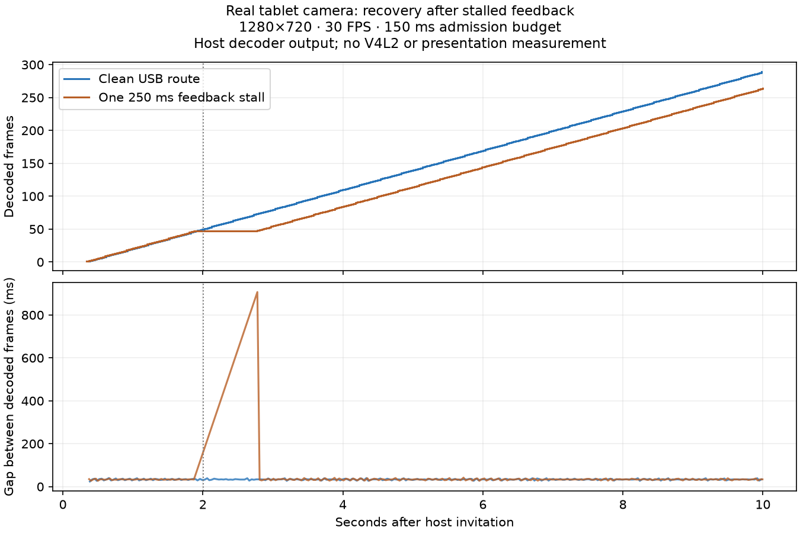

# Camera freshness — T614, T616, T617, T618

T614 implements BLCAM002, one packet in flight and a connection-local u64
acceptance counter. Feedback is sent only after the host writes the complete
packet to decoder stdin. It bounds transport admission; it does not certify
that FFmpeg decoded or a webcam consumer displayed the picture.

Sender logs preserve packet identity, feedback time and relative encoder-queue
age every 30 packets. Age compares PTS progression with sender monotonic time
since the first output; initial capture/encode delay is excluded. Camera2's
sensor clock is logged, not blindly subtracted from MediaCodec timestamps:
[Android documents compensation on direct encoder surfaces](https://developer.android.com/reference/android/hardware/camera2/CameraMetadata#SENSOR_INFO_TIMESTAMP_SOURCE_REALTIME).

The permanent real-H.264 upload regression failed before the change with
`T614 missing bounded camera feedback`, then passed. All 19 host camera tests
and the Android camera suite pass. JaCoCo measured all 34 functions in the
changed Android files ≥80%; LLVM measured all six functions in decoder/protocol
≥80%. Complexity: 5,825 functions, none above nine. [Evidence](artifacts/2026-09-26-camera/freshness/).

This report separates admission, recovery and decoder-output measurements;
absolute camera-to-display latency is not measured.

## T616 — stale encoded-frame recovery

A permanent Camera2/MediaCodec adapter regression first observed seven packets
where only four were safe. It now observes four: configuration, initial keyframe,
fresh recovery keyframe and its dependent frame. Three stale/dependent frames
are dropped, exactly one sync request is issued, and every dequeued buffer is
released. Pure policy tests cover the exact freshness boundary, initial keyframe
wait, missing keyframe timeout and invalid budgets. Initial budget is 150 ms,
configurable 50–2000 ms through the portable profile, invitation, CLI and GUI.

Android changed-file coverage: 35/35 functions ≥80%. Rust profile, bridge and
camera settings: 20/20 functions ≥80%, including the full GUI suite. Camera host
suite remains 19/19 passing. Complexity: 5,832 functions, none above nine.

## T617 — whole-packet deadlines and generation retirement

The missing-feedback regression exceeded its 500 ms test bound before the fix;
with a configured 50 ms budget it now terminates and rejects reuse. A separate
real-socket regression blocks a 2 MiB packet mid-write, verifies only a prefix
arrived and ensures the retired connection cannot accept a new packet. Okio's
socket deadlines share one absolute deadline across write and feedback phases;
its normal 8 KiB staging is preserved. Host decoder input and ACK writes use the
configured freshness budget too.

Recovery is bounded to two retries with 250/500 ms backoff inside the original
consent owner. Tests prove resources retire before the next attempt, final
failure stops, cancellation during I/O/backoff prevents reopening, and unrelated
camera errors do not retry. Camera adapter tests exercise the production recovery
entry point. All 58 functions in changed Android files and all four host decoder
functions meet ≥80% coverage. All 19 host camera tests pass; complexity gate
reports 5,841 functions, none above nine.

## T618 — bounded rate adaptation and native acceptance

Adaptive mode defaults on, with a requested ceiling and configurable 1000 kbit/s
floor capped by that ceiling. Three ≥75%-budget feedback/queue-age samples,
spaced by a one-second change cooldown, lower the target 25%. A transport failure
lowers the next encoder generation immediately. Five seconds of ≤one-third-budget
healthy samples allow a 10% increase (minimum 64 kbit/s), capped at the ceiling.
Neutral samples reset recovery. Users can disable adaptation for a fixed rate.
The controller uses constant space; no new dependencies or packet-copy queue.

The permanent adapter regression first failed because sustained queue pressure
left the target unchanged. It now requests 2,250,000 bit/s from a 3,000,000 target.
Policy regressions cover hysteresis, floor/ceiling, fixed mode, invalid values,
neutral feedback and recovery. A real-socket Camera2 fixture verifies retries
send configuration again, reset ACK sequence and retain the reduced target.
42/42 changed Android functions and 20/20 changed Rust profile/bridge/UI functions
meet the 80% coverage gate. The existing producer-failure test hung during one
concurrent coverage run; that interrupted run is not a pass. A bounded isolated
rerun passed all 19 camera tests; T620 retains the harness race for repair.

The signed production APK was installed on RugKing Pad 2 Pro, API 36. The
opt-in `cargo run -p blent --example camera-feedback-probe -- --seconds 10`
benchmark imports the production host protocol/decoder, uses the real camera,
and retains counts/timestamps only. Front camera reported timestamp source
UNKNOWN (0), supporting the relative-age label. The first run included a user
permission prompt (7,290 ms to first frame); it is excluded from warm timing.
Warm direct USB: 289 decoded frames/10 s, first frame 358 ms, sampled feedback
2.1–3.3 ms. These are short observations, not sustained power/quality results.

| Native run, same transparent probe route | Frames / 10 s | First decoded frame | Longest decoded-frame gap |
| --- | ---: | ---: | ---: |
| Clean | 289 | 362 ms | 40 ms |
| One requested 250 ms feedback stall at 2.007 s | 264 | 340 ms | 907 ms |

The stall triggered connection retirement and an automatic fresh generation;
target fell from 3000 to 2250 kbit/s and recovered to 2475 after healthy feedback.
The graph shows recovery, not an old-versus-new throughput win. An initial proxy
trial accidentally enabled Nagle delays on its extra loopback sockets; corrected
trials set TCP_NODELAY. Those confounded raw trials are preserved in the private
profile archive, excluded from the comparison. Normal shutdown can log a final
transport failure while the probe closes its decoder before sending Stop; no
new camera opened after Stop. Android camera clients were empty afterward and
both sensors closed; only display ADB mappings 8890/8891 remained. The per-tag
logging override was restored (device global log threshold was E).

[Raw timings, logs and coverage](artifacts/2026-09-26-camera/freshness/t618/).
Full local evidence/APK: `~/.local/share/blent/profiles/2026-09-26-camera/freshness/`.
V4L2 nodes are absent and loading their installed module requires unavailable
privileged authorization: T621 retains webcam-consumer validation. No native
Windows/macOS support, display latency, sustained congestion-quality or battery
improvement is claimed. Configuration contracts remain platform independent.

Both host daemon and GUI were rebuilt and installed in the AppImage; the signed
Android APK is deployed. The user service is active, the Linux pointer remains
visible, and the 1280×800 display still uses one x264 worker. Configuration gained
only the three new camera defaults: removing their serialized lines reproduces
the exact pre-install SHA-256. Full Android unit suite and release lint pass.
