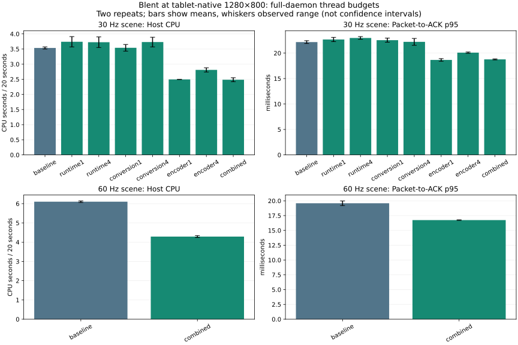

# T600: full-daemon thread-budget validation

The measured opportunity is reducing libx264 encoding workers. At the tablet's
1280×800 resolution, one requested encoder thread reduced total measured host
CPU by about 29% in the repeated 30-Hz scene, reduced live FFmpeg RSS and improved
packet-to-ACK p95. A combined runtime 4 / encoder 1 / conversion 4 setting saved
about 30% host CPU in repeated 60-Hz scenes. Reducing runtime workers alone did
not produce a repeatable CPU benefit. No production default or new configuration
surface is changed by this research; T612 tracks encoder-first auto-tuning.

## Repeated 30-Hz scene

Each cell shows first / second pass; CPU is seconds across measured host
processes in a 20-second interval, not percentage of the whole machine.

| Changed budget | Host CPU seconds | ACK p95 ms | ACK p99 ms |
| --- | --- | --- | --- |
| Baseline automatic | 3.50 / 3.57 | 21.88 / 22.45 | 26.28 / 26.02 |
| Runtime 1 | 3.57 / 3.91 | 23.09 / 22.25 | 26.95 / 27.25 |
| Runtime 4 | 3.90 / 3.55 | 23.24 / 22.71 | 26.98 / 26.36 |
| Conversion 1 | 3.43 / 3.65 | 22.94 / 22.14 | 26.18 / 25.12 |
| Conversion 4 | 3.57 / 3.89 | 22.88 / 21.53 | 28.84 / 28.88 |
| Encoder 1 | 2.50 / 2.49 | 18.91 / 18.41 | 26.98 / 21.93 |
| Encoder 4 | 2.74 / 2.88 | 19.97 / 20.21 | 25.23 / 22.32 |
| Combined 4 / 1 / 4 | 2.42 / 2.55 | 18.87 / 18.66 | 21.15 / 26.24 |

All **9,655 packets ready inside measured windows have matching ACKs** in their
traces. Most windows contain about 600 frames; the second conversion-4 window
contains 652 and is retained rather than silently excluded. Boundary-limited
ACK counts differ from ready counts in a few windows; epoch/sequence matching
across the full trace accounts for every measured ready packet. The scene is
controlled, but capture/composition cadence is not assumed perfectly identical.

Blent process thread counts are 36 automatic, 5 with runtime 1 and 8 with runtime
4. Helper counts are 31 automatic, 2 with conversion 1 and 5 with conversion 4.
FFmpeg counts are 43 automatic, 15 with encoder 4 and 4 with encoder 1. These
include infrastructure threads. The earlier pinned-x264 SEI measurements showed
12 effective encoding workers at this geometry; do not call all 43 FFmpeg
threads encoding workers or treat requests of 16/24/32 as effective workers.

Live FFmpeg RSS after the 30-Hz windows was 62.8–63.4 MiB at baseline,
37.1–38.8 MiB with encoder 1 and 46.3–46.8 MiB with encoder 4. Blent RSS stayed
roughly 12–14 MiB across budgets; reducing its runtime worker count alone did
not establish a useful native memory or CPU win. Helper CPU stayed around
1.05–1.18 seconds, including conversion-1 trials; its isolated conversion
throughput result does not establish a full-daemon CPU saving from four workers.

## 60-Hz confirmation and lifecycle

| Budget | Host CPU seconds / 20 s | ACK p95 ms | ACK p99 ms |
| --- | --- | --- | --- |
| Baseline | 6.06 / 6.14 | 19.98 / 19.20 | 25.23 / 24.57 |
| Combined runtime 4 / encoder 1 / conversion 4 | 4.24 / 4.34 | 16.70 / 16.78 | 25.73 / 19.64 |

All four windows contain **1,200 ready packets and 1,200 matching ACKs**. FFmpeg
CPU falls from 3.66–3.69 to 1.79–1.83 seconds. Helper CPU stays near 2.1 seconds;
Blent CPU stays near 0.12 seconds. The combined improvement agrees with the
independently measured encoder effect; it does not justify claiming that every
component of the combined setting helps. One p99 repeat is slightly worse, so
this is not a claim that every tail improves.

Both baseline and combined settings then passed separate native lifecycle
checks: 20 status queries (maximum 13.3 / 14.2 ms), Android force-stop/relaunch and
render reconnect, temporary owned-output resize to 1024×768, and restoration to
1280×800. Each transition resumed at least 30–60 new ACKs as appropriate. The
extra display mode was removed, original config bytes were unchanged and the
normal service was restored. These are bounded native checks, not permanent
correctness substitutes or an exhaustive control-load campaign. Existing
ownership/cancellation regressions remain unchanged. Mouse visibility stayed
true throughout the new ramp and lifecycle checks.

## Syscalls and scheduler attribution

Separate five-second traces show FFmpeg futex calls dropping from **56,852**
(baseline) to **1,949** (encoder 1), **9,689** (encoder 4), and **1,930** (combined).
Summed FFmpeg futex wall time drops from 131.3 to 14.7 thread-seconds for encoder
1; these overlapping waits are not CPU seconds. The independent CPU counters
above establish the CPU improvement. Completed calls only are counted; trace
boundary/noncomplete lines and unmapped transient children remain explicit in
the artifacts.

Baseline / encoder-1 FFmpeg scheduler wakeups are **7,209 / 863** per five-second
window. Their p95 runnable delays are **7.0 / 8.1 microseconds**, not a reduction
in scheduler latency. The reduction is in wakeup volume and codec work. All eight
scheduler recordings contain no LOST records. Per-process and per-thread
summaries retain all other variants.

Blent recorded zero completed futex calls in baseline/encoder-1 windows; this
does not mean it has no locks, since uncontended userspace locks need no syscall.
Its epoll waits total about 4.93–4.94 seconds and completed reads about 2 ms.
FFmpeg reads wait about 4.96–4.98 seconds for input. Helper poll waits about 4.69
seconds. These waits leave CPU available and are not evidence that replacing
`epoll`, `poll` or `read` improves performance.

Helper ioctls take about 0.18 / 0.17 thread-seconds per five-second trace; ADB
ioctls total about 4.92 / 4.94 seconds, including waits for USB completion.
No generic newer ioctl replacement removes EVDI or USB driver semantics.
[T599](2026-09-26-evdi-ownership.md) already ruled out skipping required EVDI
copy/acknowledgement. Keep the existing APIs unless a measured bottleneck and
compatible native interface justify additional code.
## Method and boundaries

Actual tablet geometry: 1280×800. Full Blent daemon, production Android client,
EVDI helper, pinned FFmpeg/libx264 and existing USB/ADB route. Camera stayed off.
The first 12 exploratory trials predated T604 and were interrupted by Cinnamon
hiding the mouse. They are retained privately, excluded from the comparisons
below. All new comparisons use the same daemon with the T604 cursor fix.

Two deterministic shuffled passes compare baseline, runtime 1/4, encoder 1/4,
conversion 1/4 and combined runtime 4 / encoder 1 / conversion 4. CLI conversion
settings and `TOKIO_WORKER_THREADS` override only the tested budget. An archived
development FFmpeg wrapper injects `-threads:v` for encoder trials. No new
production knob or default was shipped. The wrapper is not in the AppImage.

Each trial waits for 60 startup ACKs, warms the same 30-Hz X11 scene for three
seconds, then measures a 20-second interval. CPU comes from process user/system
tick deltas; RSS is live `/proc` resident pages before/after the interval, not
pre-exec lifetime peak RSS. Thread snapshots retain CPU, context switches and
scheduler counters. CPU totals include Blent, helper, FFmpeg and shared ADB;
exclude the scene generator, compositor, profiler and Android CPU.

First-pass syscall and scheduler recordings run in separate five-second windows
after the uninstrumented CPU/latency interval. Strace changes scheduling; its
wall durations include waiting and overlap across threads. They are not CPU
cost. Thread names/owners are retained. Scheduler parsing checks the recorded
sample type, uses archived same-kernel event formats, and rejects LOST records.
Wake-to-run tails are from completed in-window intervals, excluding boundary
intervals without both endpoints. Source and raw data are archived.

ACK latency starts when an encoded packet is ready and ends when its Android
render acknowledgement reaches the host. It excludes capture, encoding and
optical display latency. Counts can differ by one at interval boundaries; the
raw sequence/epoch records distinguish those from missing acknowledgements.
Real desktop composition remains a noise source, so report both repeats and
measured frame counts. This is one tablet/content fixture, not T382's broad
hardware campaign or proof of a universal optimum.

## Quality comparison

The earlier 60-FPS encoder ramp retained its exact raw NV12 source and all 24
encoded streams. Each stream is decoded and compared with the original, both
set to frame-index-based 60-Hz timestamps and yuv420p. Each of the 24 comparisons
contains exactly 360 frames. The fixed CRF 18 / maximum-rate policy and sliced
thread settings can change quality as thread counts change; do not infer equal
quality from equal command-line bitrate alone. PSNR is a fixture metric, not a
subjective quality or camera-sensor result.

| Requested encoder workers | Aggregate PSNR range, dB (3 trials) | Encoded payload Mb/s |
| --- | --- | --- |
| 1 | 53.054–53.054 | 16.361–16.361 |
| 2 | 50.613–50.657 | 14.644–14.659 |
| 4 | 52.206–52.280 | 16.181–16.225 |
| 8 | 39.975–39.979 | 15.876–15.896 |
| 12 | 38.388–38.705 | 16.203–16.228 |
| 16 (12 effective) | 37.964–38.708 | 16.196–16.240 |
| 24 (12 effective) | 38.391–39.223 | 16.207–16.221 |
| 32 (12 effective) | 38.389–38.821 | 16.191–16.213 |

One/four workers do not sacrifice PSNR on this exact fixture. The large quality
spread reinforces the need to validate bitrate/quality together with latency;
it does not prove a universal perceptual improvement or explain every x264
rate-control decision. The reported PSNR is FFmpeg's aggregate value for
the 360-frame comparison; per-frame measurements are retained.

## Retained evidence and outcome

[Curated artifacts](artifacts/2026-09-26-followup/t600/) contain full summaries,
per-thread syscall/scheduler results, quality logs, native lifecycle results,
plots, source/build identities, recipes and checksums. Complete raw recordings,
logs and interrupted pre-fix trials are private under
`~/.local/share/blent/profiles/2026-09-26-followup/t600/`. The original 24 encoded
streams and raw NV12 reference remain in the separate thread-ramp archive.

T600 closes the requested investigation. T612 is the focused follow-up: extend
the existing selector to test encoder-worker budgets first, preserve manual
overrides/auto and include the budget in cache identity. Native futex evidence
guides this priority; ordinary calibration must not require privileged tracing.
Do not add new runtime/conversion defaults, a second optimizer or a new transport
stack on the basis of these results. The T603 tuning proposal can use these
measurements when its bounded selector work is separately implemented.
