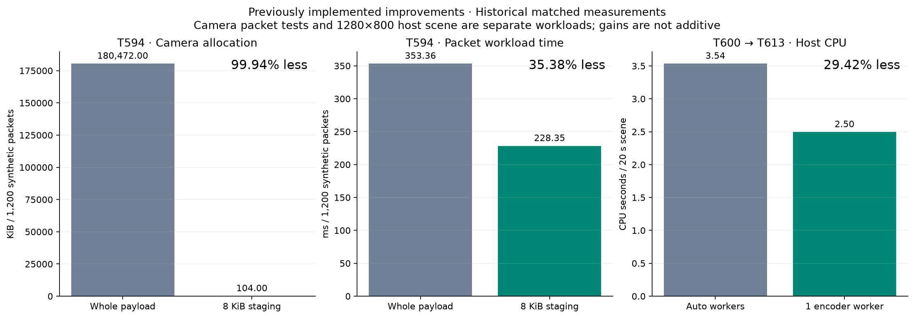
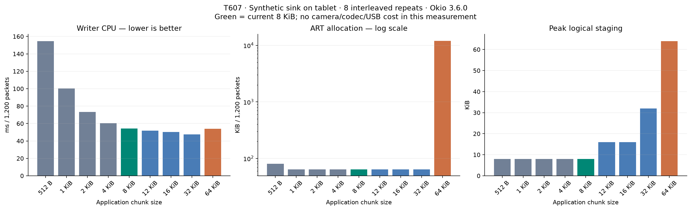
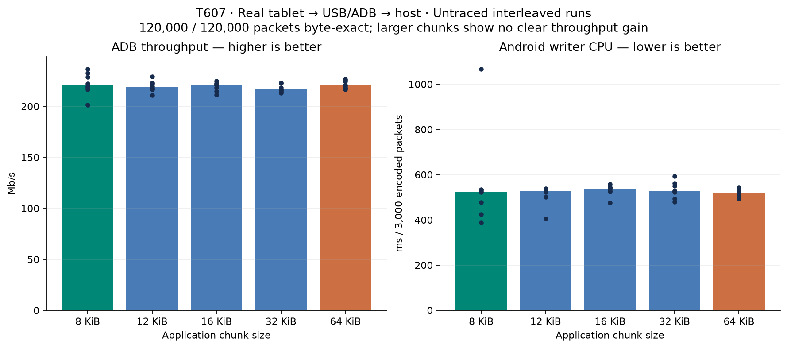
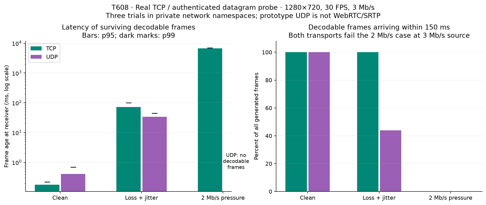
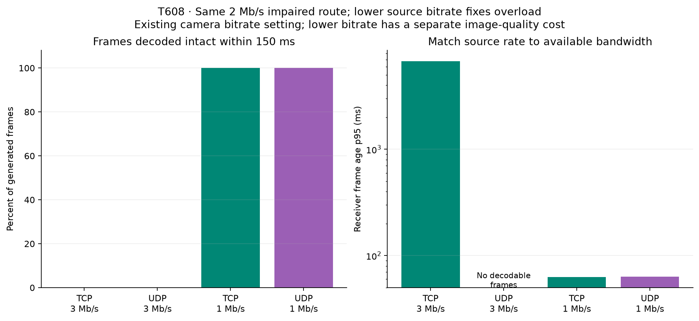

# Blent performance graphs

The first chart shows improvements already implemented. The remaining charts
show the new T607/T608 measurements, including cases where a proposed change
would not improve the real route. Units and workload boundaries are explicit;
percentages from different workloads must not be added together.

## Implemented improvements

T594 camera packet staging reduced measured ART allocations by 99.94% and
workload elapsed time by 35.38%. T600's matched 1280×800 scene used 29.42% less
host CPU with one encoder worker; T613 made that worker setting the default.
These are historical matched measurements, not new live-camera measurements.

[SVG](artifacts/2026-09-26-camera/graphs/implemented-improvements.svg) ·
[T594 evidence](2026-09-26-camera-staging.md) ·
[T600 evidence](2026-09-26-full-daemon-thread-budgets.md) ·
[T613 default](2026-09-26-single-worker-default.md)

## Chunk sizes, including 12 and 16 KiB

Larger chunks reduce synthetic writer overhead, but 12/16/32/64 KiB do not
establish a useful USB/ADB throughput gain. The production default remains
8 KiB. Each dot in the ADB chart is one untraced run.

[Local SVG](artifacts/2026-09-26-camera/graphs/chunk-local.svg) ·
[ADB SVG](artifacts/2026-09-26-camera/graphs/chunk-adb.svg) ·
[Methods, values and raw data](2026-09-26-camera-chunks.md)

## Transport and bitrate

The datagram probe's lower latency among surviving frames hides many unusable
H.264 reference chains. Under a 2 Mb/s route limit, matching the source bitrate
to capacity improves freshness for **both** protocols. A smaller bitrate has
an image-quality cost. No production UDP/WebRTC stack was added.

[Transport SVG](artifacts/2026-09-26-camera/graphs/transport-tradeoffs.svg) ·
[Bitrate SVG](artifacts/2026-09-26-camera/graphs/transport-bitrate.svg) ·
[Methods, quality and limitations](2026-09-26-camera-transport.md)

All plots have PNG and standalone SVG versions. Their Python generators and
underlying measurements are retained in the repository. Artifact integrity is
listed in [SHA256SUMS](artifacts/2026-09-26-camera/SHA256SUMS).
