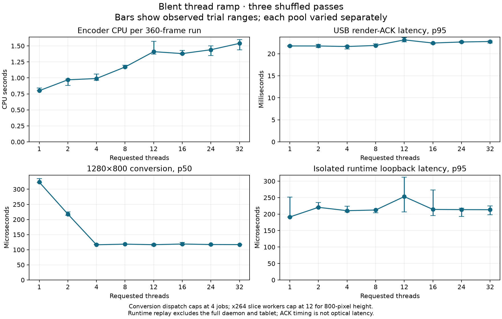

# Thread ramp at tablet geometry

T600 measured requested budgets **1, 2, 4, 8, 12, 16, 24, 32** independently,
with three deterministically shuffled passes per pool. The attached tablet's
1280×800 geometry guides the conversion and encoder conclusions. The original
1920×1080 conversion fixture is retained as a separate comparison, not used to
choose the tablet's budget. No production defaults or device preferences changed.

The useful candidates are four conversion participants and one to four encoder
threads for this workload. The runtime replay does not justify changing the
full daemon's runtime budget. These are candidates for full-session validation,
not a global optimum or a battery-life result.

[SVG](artifacts/2026-09-26-thread-ramp/ramp.svg) and
[all summaries/trials](artifacts/2026-09-26-thread-ramp/summary.json) retain the
observed variation. Error bars are the minimum/maximum of three trials, not
confidence intervals. Summaries take the median of per-trial measurements;
latency percentiles use nearest rank within each trial.

## Encoder through the actual tablet

The normal libx264 encoder policy was exported from `blent-config` at 60 FPS,
20,000 kb/s maximum rate and CRF 18. Each run changes only `-threads:v`; filter
thread settings stay at their defaults. A fixed FFmpeg `testsrc2` NV12 corpus
contains 360 frames at 1280×800, admitted at 60 FPS into the same bundled FFmpeg
executable for every trial. The encoder executable/libs use the retained runtime
from the preceding GPU/profile experiments; exact version/hash is in metadata.

Encoded frames pass through ADB USB into the separate decoder replay APK using
`c2.unisoc.avc.decoder`. This preserves native USB/decoder/render-callback timing
without replacing the live display or changing Blent's settings. Encoder packet
checksums are verified by the retained tee parser. All **8,640 encoded frames
received render ACKs**, including all measured frames. Each latency window
excludes the first and last 60 frames, retaining the middle 240.

| Requested threads | x264 effective threads | CPU seconds/run | Encoder-ready p95 ms | Render-ACK p95 ms | Peak RSS KiB |
| ---: | ---: | ---: | ---: | ---: | ---: |
| 1 | 1 | 0.80 | 3.23 | 21.76 | 39,700 |
| 2 | 2 | 0.97 | 3.06 | 21.76 | 44,440 |
| 4 | 4 | 0.99 | 2.21 | 21.64 | 47,684 |
| 8 | 8 | 1.17 | 2.00 | 21.87 | 57,168 |
| 12 | 12 | 1.41 | 1.89 | 23.14 | 64,724 |
| 16 | 12 | 1.38 | 1.97 | 22.43 | 65,420 |
| 24 | 12 | 1.44 | 1.93 | 22.66 | 64,604 |
| 32 | 12 | 1.54 | 2.12 | 22.78 | 64,724 |

CPU is FFmpeg user+system CPU for the complete roughly six-second process,
including initialization/warmup/cooldown, measured by GNU time. It excludes
Python, ADB, Android and host capture. RSS is that process's lifetime peak, not
incremental per-thread memory. Both latency columns begin at raw-input admission
before FIFO backpressure. The ACK column ends when the host receives the Android
render callback acknowledgment; it excludes capture/compositor and is not optical
presentation latency. Scheduled-frame-to-ACK p95/p99 are also retained.

Relative to requested 32, requested four used about 36% less encoder CPU in this
cohort, with similar or lower ACK latency. One thread used still less CPU while
spending roughly one extra millisecond before encoder packet readiness. Small
differences around 21–22 ms should not be promoted as a universal latency win.
The requested thread count can affect other FFmpeg setup even when x264 clamps
its own workers; variation above 12 does not establish the cause of that cost.
Output byte counts vary with slicing/VBV behavior. Fixed CRF/options do not prove
identical visual quality; no PSNR/SSIM comparison or broader scene acceptance is
claimed. Quality-sensitive policy selection remains T603 research.

### Why the cap is 12

The encoded SEI identifies x264 core 164, revision `baee400`, and records effective
`threads`, `lookahead_threads` and slice settings. This revision's
[parameter validation](https://github.com/mirror/x264/blob/baee400/encoder/encoder.c#L529-L539)
limits sliced threading to `max(1, floor(ceil(height / 16) / 4))`. At height 800,
50 macroblock rows yield 12 workers. This is an upstream performance/buffer-model
heuristic, not a hardware limit or a Blent hard-coded ceiling. Requests above 12
therefore do not test 16/24/32 effective slice workers. Patching x264 or changing
to frame threading would be a separate experiment with different latency and
ownership consequences, not a configuration-only extension of this ramp.

## Conversion

The exact production conversion/frame-exchange sources are copied and compiled
at `-O3`; the existing byte-checked conversion harness now permits compile-time
dimensions while preserving its 1080p default. Each trial converts 256 frames
after initialization with either sparse or full dirty rows. No encoder, EVDI
readback or device transport is included in this unpaced CPU microbenchmark.
Every output checksum agrees across budgets and damage patterns.

| Requested participants | Dispatched full-frame jobs | 1280×800 conversion p50 µs | Conversion p99 µs |
| ---: | ---: | ---: | ---: |
| 1 | 1 | 323.5 | 491.9 |
| 2 | 2 | 217.9 | 250.0 |
| 4 | 4 | 116.4 | 167.3 |
| 8 | 4 | 118.5 | 177.9 |
| 12 | 4 | 116.8 | 175.6 |
| 16 | 4 | 118.9 | 170.9 |
| 24 | 4 | 117.3 | 143.6 |
| 32 | 4 | 117.0 | 138.5 |

Participants include the caller. Adaptive dispatch uses roughly one job per
262,144 dirty source pixels, so full 1280×800 uses at most four; sparse updates
use fewer. Increasing pool capacity above that does not create additional
per-frame parallelism. The separate 1080p series reaches eight jobs: p50 fell
from 639.2 µs at one to 124.0 µs at eight, then stayed around 124–126 µs.
This supports geometry-aware capacity evaluation, not a universal four-thread
ceiling. Higher resolutions, scale and resize behavior must remain supported.

## Runtime

A separate optimized Rust executable uses the exact production `video_queue.rs`
and `media_storage.rs`, plus a minimal matching `VideoPacket` shape. An external
producer publishes 64 KiB packets at 60 Hz; a Tokio task receives and writes them
to a local TCP consumer which verifies sequence and every payload byte. Each
run has 360 packets with the middle 240 used for latency. All 24 runs completed
without queue loss or corrupt bytes. The runtime is created with the requested
worker count; producer/consumer threads are fixed and outside that budget.

| Runtime workers | Process CPU ms/run | Loopback p95 µs |
| ---: | ---: | ---: |
| 1 | 54.0 | 191.3 |
| 2 | 78.5 | 220.5 |
| 4 | 56.6 | 210.3 |
| 8 | 77.2 | 212.4 |
| 12 | 75.2 | 253.1 |
| 16 | 66.5 | 214.1 |
| 24 | 80.8 | 213.5 |
| 32 | 65.4 | 213.3 |

CPU covers producer, queue, socket, consumer byte verification and paced waits,
excluding runtime creation. One worker used fewer voluntary context switches
(median 1,088 versus roughly 1,450 for the other budgets), but the results are
small and non-monotonic. This is not the complete daemon, its blocking pool,
authentication, control traffic or device lifecycle, and contains no tablet.
Retained `getrusage` lifetime peak-RSS values may include the launcher before
exec, so they must not be interpreted as isolated runtime-worker resident memory.
T600 still needs live process memory and complete-host validation before policy.

## Preservation, validation and next decisions

The versioned artifact directory contains metadata, summarized and raw numeric
results, replay logs/commands, plots and SHA-256 checksums. Full NV12 corpus,
encoded streams, generated source/builds, source snapshots, binaries and APK
identity are preserved privately at:

`/home/netto/.local/share/blent/profiles/2026-09-26-thread-ramp/`

Preparation/builds and each benchmark family ran sequentially during measured
windows. The normal desktop remained active; frequency and background activity
were not controlled. Three shuffled repetitions reduce ordering bias without
establishing statistical confidence or sustained thermal/battery behavior.
Android returned to normal Blent afterward, ADB reverse routes matched their
initial snapshot, and camera remained off. Existing benchmark helper tests and
conversion source-copy tests pass; permanent production regressions were not
changed. Benchmark-only work is exempt from new coverage-only tests.

T600 remains open for full-daemon attribution and matched validation of promising
budgets, including startup/reconnect/resize, competing control work and native
memory. T598 improves profiling evidence; T593 precedes T599's redundant readback
work. T603 extends the existing selector/cache with tablet-guided, bounded tuning
research; no production self-tuning policy has been implemented here.

To reproduce, run `thread-ramp-conversion.py` at the target width/height and keep
the default 1080p comparison in `conversion`; put the 1280×800 run in
`conversion-1280`. Build the runtime with `thread-ramp-runtime.py --build-only`
before measurements, then invoke it again without that flag. Export the existing
`encoder-options` example and generate 360 `testsrc2` NV12 frames at 1280×800/60
before invoking `thread-ramp-encoder.py` with those files, the matching FFmpeg
runtime and the connected serial. The encoder replay requires the separately
installed benchmark APK and an unlocked foreground Blent. Each script exposes
its required paths with `--help`; summarize with `summarize-thread-ramp.py` and
plot with `plot-thread-ramp.py`. Keep benchmark families serial and do not
compile/test concurrently with timed trials.
